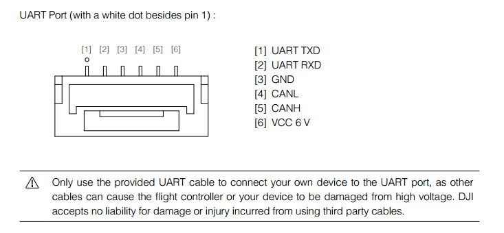
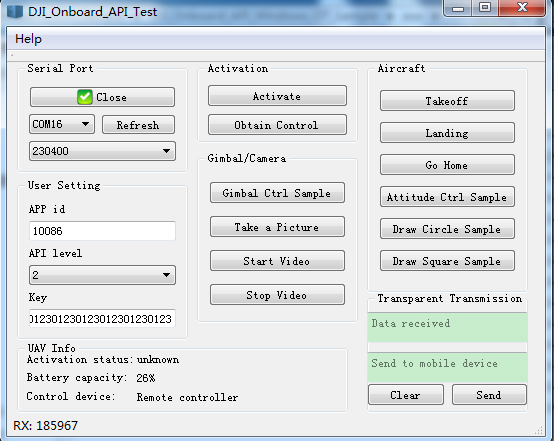

# Step to Activate Onboard SDK

To help DJI Developers get rolling with the Onboard SDK, we’ve listed seven key steps to quickly set up your programs and devices – so listen up!

*Warning: Remove the propellers from your aircraft before you begin.*

## 1.	Apply for a DJI Developer Account
Go to https://dev.dji.com/en/products/sdk/onboard-sdk and apply for a DJI developer account with SDK level 2 access. You will receive your App ID and Key once your application gets approved.

## 2.	Enable API Control
Connect the aircraft to your PC with a USB cable. Launch the DJI N1 Assistant and check the box next to "Enable API control”.

## 3.	Configure the Baud Rate
For QT Sample, the baud rate is 115200. After you have finished, close the N1 Assistant.

## 4.	Start the PC Simulator
Use PC as the onboard device, Restart your aircraft while keeping it connected to the PC. Launch the DJI PC Simulator, click “Display Simulator” and then click “Start Simulation”. We recommend enabling “Auto Executing UI” so that next time the simulator will be displayed automatically. 

You will see a model of the Matrice 100 on the simulator screen as shown below.   

Note that you need to restart the simulation if the aircraft is disconnected from your PC.

## 5.	Connect Your Mobile Device
Ensure your Android or iOS mobile device has an internet connection, and connect it to the remote controller. Launch the DJI GO or DJI Pilot app.

## 6.	Connect Your Onboard Devices
Connect your onboard devices to the aircraft’s UART ports.

## 7.	Activation
Take “DJI_Onboard_API_Windows_QT_Sample” as an example:
* Connect the aircraft to your PC using a UART-to-USB cable.
* Launch QT Sample on your PC , configure the Baud rate on your PC so that it matches the rates of the aircraft (refer to step 3).
* Open Serial Port and check the aircraft data under UAV Info.
* Click 'Activation' button to activate N1 Autopilot.

