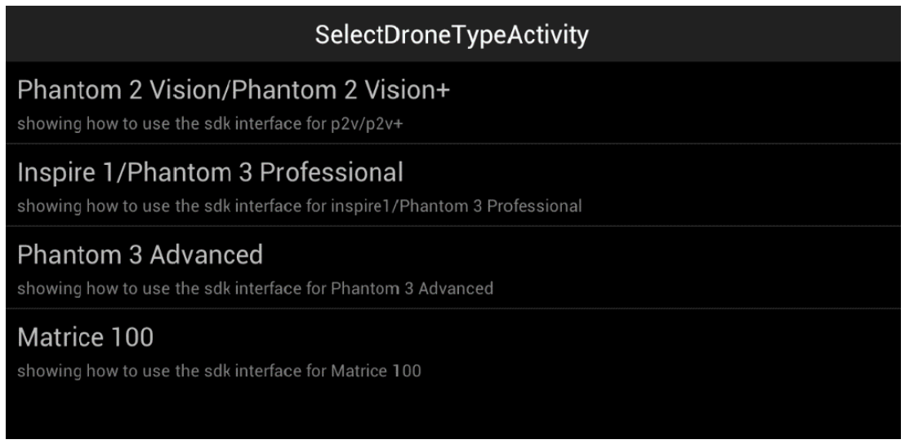
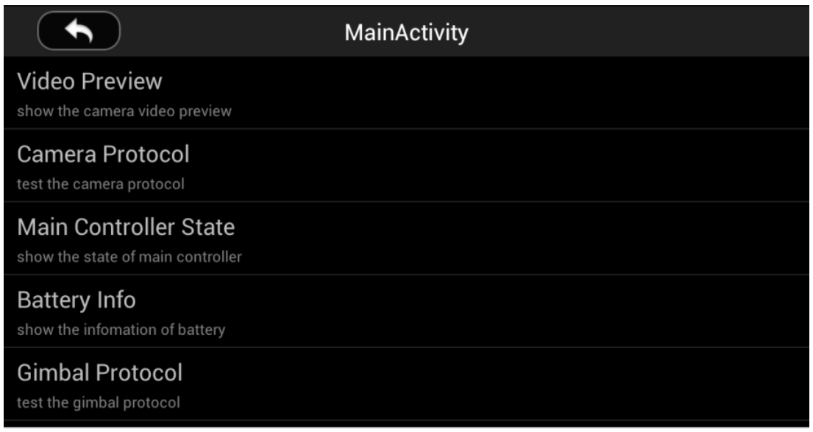
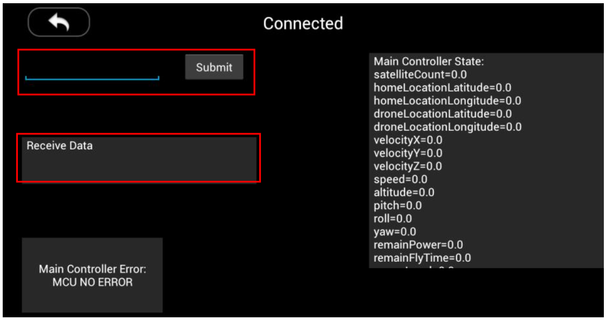

#移动设备与机载设备数据透传使用说明

最后更新: 2015年06月15日

*若此markdown版本的文档与最新版pdf文档有冲突，以pdf文档为准并请将此报告给我们*

*若最新版本的中英文pdf文档有冲突，请报告给我们*
<br>
<br>

---
##目录

+ 数据透传功能介绍
  + 数据透传功能的开发目的
+ 机载设备透传数据至移动设备
  + 机载设备发送数据至飞控
  + 飞控发送数据至移动设备
+ 移动设备透传数据至机载设备
  + 移动设备发送数据至飞控
  + 飞控发送数据至机载设备

<br>

##数据透传功能介绍

在本章中，我们将对移动设备和机载设备之间的数据透传功能做一个整体介绍，包括开发这一功能的主要目的、数据透传的使用方法，以及相关的示例代码。

开发者需注意移动设备透传数据给机载设备的通信带宽约 1KB/s，机载设备透传数据给移动设备的通信带宽约为 8KB/s。

<br>

###数据透传功能的开发目的

DJI 为开发者提供了两种功能完善的 API 帮助开发飞行应用：Mobile API 和 Onboard API。Mobile API允许开发者基于iOS/Android编写相应的移动端应用以控制飞行器，而Onboard API则允许开发者基于 Windows/Linux 编写相应的 PC 端应用，或直接利用单片机等其他计算设备编写相应控制程序，并将相应的计算设备挂载到飞行器上，通过串口直接控制飞行器。

两者相较而言，使用 Mobile API 不需另购机载设备，且操作简单直观，开发者可直接在移动端实时观察飞行器运行状态。然而由于移动设备计算能力通常较小，且数据需要经过无线链路传输，不可避免的对控制程序的实时性和复杂度产生限制；使用 Onboard API 可将计算设备直接挂载在飞行器上，并且通过有线进行数据传输，这使得开发者可以对飞行器进行实时可靠的复杂控制。需要注意的是，使用 Onboard API 进行控制时，由于机载设备已经挂载在飞机上，用户无法直接获取程序的运行状态，属于一定程度上的“盲飞”。当程序跑飞或出现其他特殊状况时，用户只能手动切入遥控器控制。

基于上述考虑，我们开发了移动设备和机载设备之间的数据透传功能。开发者可以从移动设备端向机载设备发送数据，用以控制机载设备端的程序运行等；也可以从机载设备端向移动设备发送数据，以便开发者监控程序运行等。

简要来讲，数据透传功能可以作为 Mobile API 与 Onboard API 之间的通信桥梁，方便开发者最大限度的实现自己的定制开发


<br>

##机载设备透传数据至移动设备

###机载设备发送数据至飞控

机载设备与飞控之间的通信方式以《DJI Onboard API 说明文档》中介绍数据透传部分相关章节为准，本文档将在上述文档基础上详细说明。

机载设备至飞控的相应通信协议说明如下：

    命令集：0x00
    命令码：0xFE

|数据类型|偏移（字节）|大小（字节）|说明|
|---------|------|----|-----------|
|请求数据|0|0~100|需要发送给REMOTE 端的数据|
|应答数据|0|2|返回码／应答码 0：成功|

```c
char cmd_buf[10];
cmd_buf[0] = 0x00;
cmd_buf[1] = 0xFE;
memcpy(&cd_buf[2], "Hello!", 7);
Linklayer_Send(SESSION_MODE3,
                cmd_buf,
                9,
                0,
                200,
                3,
                0
);
```

<br>

###飞控发送数据至移动设备

以 Android 系统为例，开发者可进入 DJI-SDK-DEMO 应用程序，选择合适机型（**数据透传功能暂仅支持Matrice100**）。选择合适机型后，可使用相关功能查看飞行器状态，并在 Main Controller State 页面中使用透传功能4）。用户可从移动设备端向机载设备发送数据，也可接收来自机载设备端的数据。





相关的示例代码如下：

1. iOS
  ```cSharp
  //设置委托
  inspireMC.mcDelegate = self;
  
  //实现委托函数，当接受到数据的时候，该函数被调用
  (void)mainController:(DJIMainController*)mc didReceivedDataFromExternalDevice:(NSData*)data {
    //data为接收到的数据
    NSLog(@"%@",data);
  }
  ```
  
2. Android
  ```java
  //接收主控透传过来的数据回调接口
  DJIMainControllerExternalDeviceRecvDataCallBack mExtDevReceiveDataCallBack = null;
  
  ///回调接口实例化
  mExtDevReceiveDataCallBack = new DJIMainControllerExternalDeviceRecvDataCallBack() {
    @override
    public void onResult(byte[] data) {
      //data:接收到的数据
    }
  };
  
  //设置回调接口
  DJIDrone.getDjiMC().setExternalDeviceRecvDataCallBack(mExtDevReceiveDataCallBack);
  ```

<br>

##移动设备透传数据至机载设备 

###移动设备发送数据至飞控

相关示例代码如下：

1. iOS
  1. 初始化，创建对象并连接到飞行器
  ```cSharp
  //根据飞行器类型创建 DJIDrone 对象
  DJIDrone* drone = [DJIDrone droneWithType:DJIDrone_Inspire];
  //从 DJIDrone 对象获取主控对象
  DJIInspireMainController* inspireMC = (DJIInspireMainController*)drone.mainController;
  //开启通信连接
  [drone connectToDrone];
  ```
  2. 发送数据
  ```cSharp
  //透传数据，大小不能超过 100 字节
  NSData* data = [NSData dataWithByte:"..."];
  //发送透传数据给外设，并通过回调检查发送状态
  [inspireMC sendDataToExternalDevice:data withResult:(^(DJIError* error)){
    if(error.errorCode == ERR_Successed){
      //数据发送成功
    }
    else if(error.errorCode == ERR_InvalidParam) {
      //data 数据为空或超过 100 字节
    }
    else {
      //数据发送失败
    }
  }];
  ```
  
2. Android
  ```java
  //需要发送的透传数据, 大小不能超过 100 字节
  byte[] data = {0};
  //发送透传数据给飞控
  DJIDrone.getDjiMC().sendDataToExternalDevice(data,new DJIExecuteResultCallback(){
    @override
    public void onResult(DJIError result) {
      //result 为发送后返回结果:
      //1. result == DJIError.ERR_PARAM_IILEGAL,  data 可能为空或者长度超过 100
      //2. result == DJIError.ERR_TIMEOUT,        发送失败
      //3. result == DJIError.RESULT_OK,          发送成功
    }
  });
  ```
<br>

###飞控发送数据至机载设备

相关的通信协议说明如下：

    命令集： 0x02
    命令码： 0x02

|数据类型|偏移（字节）|大小（字节）|说明|
|---------|------|----|-----------|
|推送数据|0|1~100|用户自定义数据|
|应答数据|0|0|无应答数据|
